# SkillPath - Complete User Flow Analysis

## Overview
SkillPath is a Career Growth & Skill Gap Analysis Platform that helps users identify skill gaps, create personalized learning roadmaps, and track progress toward their career goals.

---

## 🎯 High-Level User Journey Flowchart

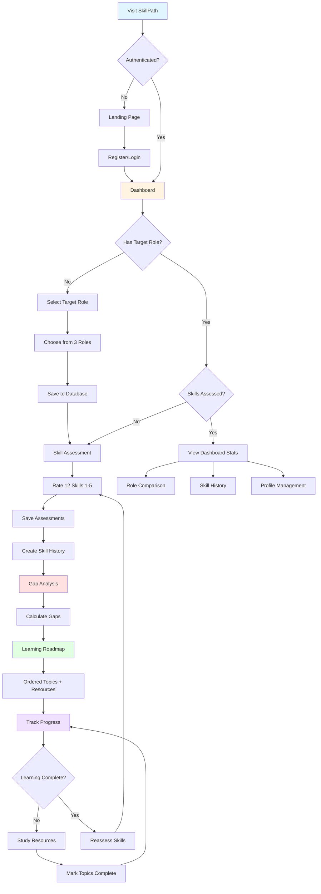

---

## 🎯 Application Architecture

### Frontend (Angular 19)
- **Port**: http://localhost:4200
- **Styling**: Tailwind CSS with dark/light mode
- **State Management**: Angular Signals
- **HTTP**: HttpClient with interceptors
- **Authentication**: JWT with localStorage

### Backend (Node.js + Express)
- **Port**: http://localhost:3000
- **Database**: MongoDB with Mongoose
- **Auth**: JWT + bcrypt
- **API Docs**: Swagger UI at http://localhost:3000/api-docs

---

## 🔄 System Architecture Diagram

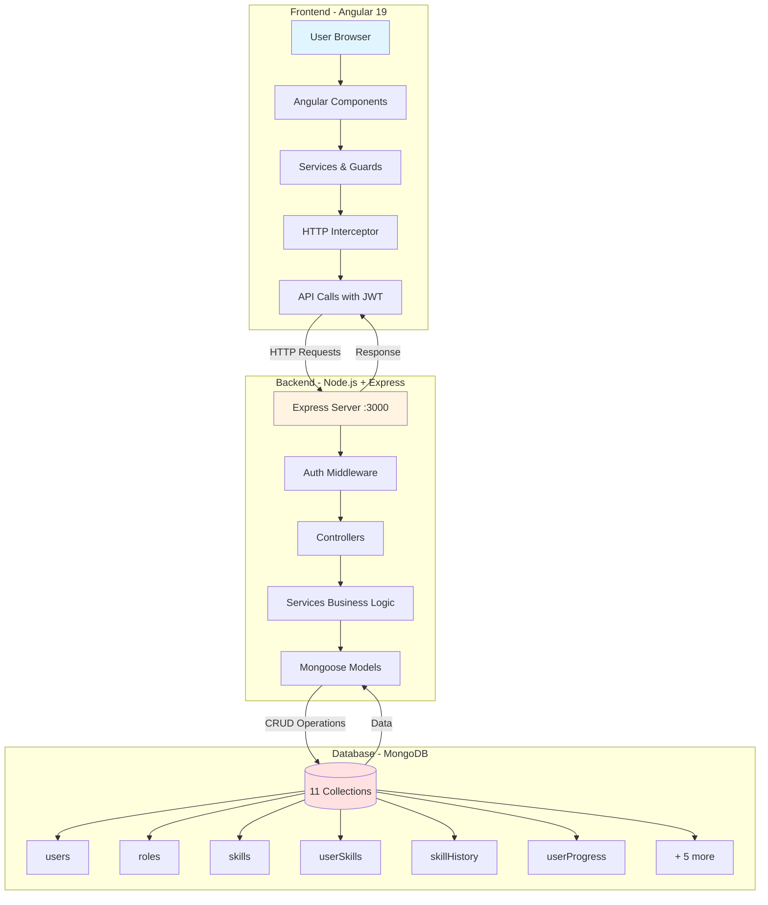

---

## 📱 Complete User Journey

### **Phase 1: Landing & Authentication**

#### 1.1 Landing Page (`/`)
**Frontend**: `LandingComponent` (MainLayoutComponent)
**Route**: Public (no auth required)

**User sees**:
- Hero section explaining SkillPath
- Feature cards (Skill Assessment, Gap Analysis, Learning Roadmap, Progress Tracking)
- Call-to-action buttons
- Header with Login/Register buttons and theme toggle

**Actions available**:
- Click "Get Started" → Redirects to `/register`
- Click "Login" → Redirects to `/login`
- Click "Register" → Redirects to `/register`
- Toggle dark/light mode

---

#### 1.2 Registration (`/register`)
**Frontend**: `RegisterComponent`
**Backend**: `POST /api/auth/register`
**Guard**: `guestGuard` (prevents authenticated users)

**User Flow**:
1. User fills form:
   - Name (required, 2-100 chars)
   - Email (required, unique, valid format)
   - Password (required, min 8 chars)
   - Experience Years (optional, 0-50)

2. Frontend submits to backend
3. Backend:
   - Validates input
   - Checks if email exists
   - Hashes password with bcrypt
   - Creates user in MongoDB
   - Generates JWT token
   - Returns token + user object

4. Frontend:
   - Stores JWT in localStorage (`skillpath_token`)
   - Stores user in localStorage (`skillpath_user`)
   - Updates `AuthService.currentUser` signal
   - Redirects to `/dashboard`

**Backend Controller**: `auth.controller.js::register`
**Database**: Creates document in `users` collection

---

#### 1.3 Login (`/login`)
**Frontend**: `LoginComponent`
**Backend**: `POST /api/auth/login`
**Guard**: `guestGuard`

**User Flow**:
1. User enters:
   - Email
   - Password

2. Backend:
   - Finds user by email
   - Compares password with bcrypt
   - Updates `lastLogin` field
   - Generates JWT token
   - Returns token + user object (with `targetRoleId`)

3. Frontend:
   - Stores token and user in localStorage
   - Maps `targetRoleId` to `targetRole` for frontend compatibility
   - Redirects to `/dashboard`

**Backend Controller**: `auth.controller.js::login`

---

## 🔐 Authentication Flow Diagram

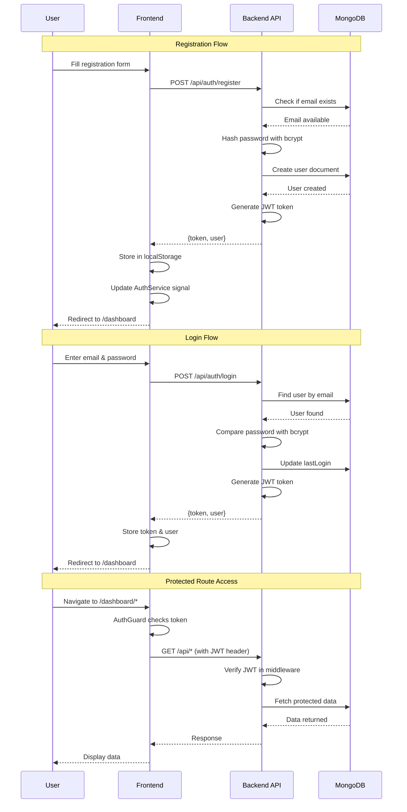

---

### **Phase 2: Dashboard & Setup**

#### 2.1 Dashboard Home (`/dashboard`)
**Frontend**: `DashboardComponent` (DashboardLayoutComponent)
**Guard**: `authGuard` (requires authentication)
**Backend**: Multiple API calls

**On Load**:
1. Check if user has `targetRole` set
2. If yes, fetch:
   - `GET /api/analysis/readiness/{roleId}` → Readiness score
   - `GET /api/analysis/roadmap/{roleId}` → Roadmap count
   - `GET /api/dashboard` → Dashboard stats

**User sees**:
- Welcome message with first name
- Target role name (if set)
- Readiness score with circular progress (if available)
- Quick action cards:
  - Select/Change Target Role
  - Assess Skills
  - View Gap Analysis
  - View Learning Roadmap
  - Compare Roles
  - View Progress History
- Getting Started Guide (if new user)

**Navigation Menu** (Desktop & Mobile):
- Dashboard
- Skills
- Roadmap
- Compare
- Profile (in dropdown)
- Sign Out (in dropdown)

---

#### 2.2 Role Selection (`/dashboard/role-selection`)
**Frontend**: `RoleSelectionComponent`
**Backend**: `GET /api/roles`, `PUT /api/auth/target-role`

**User Flow**:
1. **Load Roles**:
   - Frontend calls `GET /api/roles`
   - Backend returns all active roles from seed data:
     - Junior UI Developer (0-2 years, Frontend)
     - Senior UI Developer (5-8 years, Frontend)
     - Full Stack Developer (3-6 years, Full Stack)

2. **User sees**:
   - Current target role (if already set)
   - Grid of role cards with:
     - Role name and level badge
     - Category (Frontend/Full Stack)
     - Description
     - Average salary range (₹ INR)
     - Selection indicator

3. **User selects a role**:
   - Clicks on role card
   - Card shows blue ring and checkmark
   - "Confirm Selection" button appears

4. **Confirmation**:
   - Frontend calls `PUT /api/auth/target-role` with roleId
   - Backend updates `user.targetRoleId` in MongoDB
   - Backend returns updated user object
   - Frontend updates localStorage and signal
   - Redirects to `/dashboard/skills`

**Backend Controllers**:
- `roles.controller.js::getAllRoles`
- `auth.controller.js::setTargetRole`

**Database**: Updates `users` collection (`targetRoleId` field)

---

## 🎯 Role Selection Flow

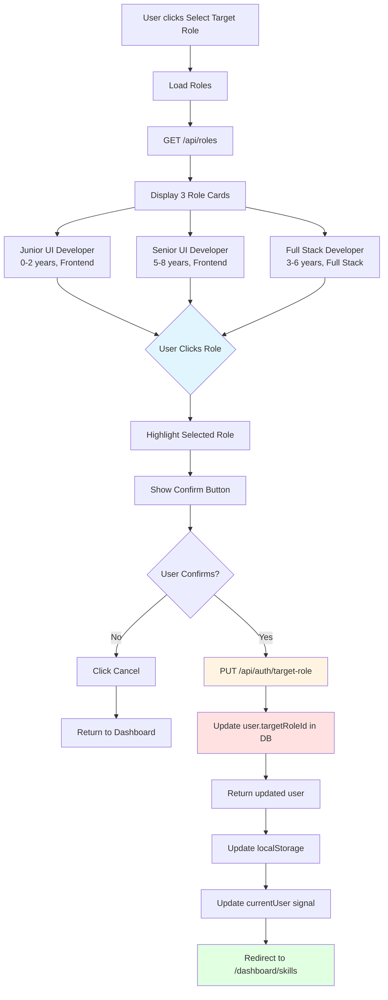

---

#### 2.3 Skill Assessment (`/dashboard/skills`)
**Frontend**: `SkillAssessmentComponent`
**Backend**: `GET /api/skills`, `GET /api/skills/levels`, `POST /api/user-skills/bulk-assess`

**User Flow**:
1. **Check Prerequisites**:
   - If no `targetRole`, show warning and "Select Target Role" button
   - If `targetRole` exists, proceed

2. **Load Data**:
   - `GET /api/skills` → All 12 core skills from seed data
   - `GET /api/skills/levels` → 5 level definitions (Beginner to Expert)
   - Load existing user skill assessments if any

3. **User sees**:
   - Skill Level Reference card at top:
     - Level 1: Beginner
     - Level 2: Basic
     - Level 3: Intermediate
     - Level 4: Advanced
     - Level 5: Expert
   
   - Skill cards for each skill (e.g., HTML/CSS, JavaScript, TypeScript, etc.):
     - Skill name and category badge
     - Description
     - 5 level selector buttons (1-5)
     - Confidence slider (0-100%) - appears after level selection

4. **User Assessment**:
   - Clicks level buttons for each skill (1-5)
   - Optionally adjusts confidence slider
   - Can assess all 12 skills or just relevant ones

5. **Save**:
   - Clicks "Save & Continue"
   - Frontend calls `POST /api/user-skills/bulk-assess` with array:
     ```json
     {
       "assessments": [
         { "skillId": "...", "currentLevel": 3, "confidenceScore": 75 },
         ...
       ]
     }
     ```
   - Backend:
     - Creates or updates `userSkills` documents
     - Records in `skillHistory` for tracking
     - Updates `lastAssessed` timestamp
   - Redirects to `/dashboard/gap-analysis`

**Backend Controllers**:
- `skills.controller.js::getAllSkills`
- `userSkills.controller.js::bulkAssess`

**Database**: 
- Reads from: `skills`, `skillLevels`
- Writes to: `userSkills`, `skillHistory`

---

## 📊 Skill Assessment Flow

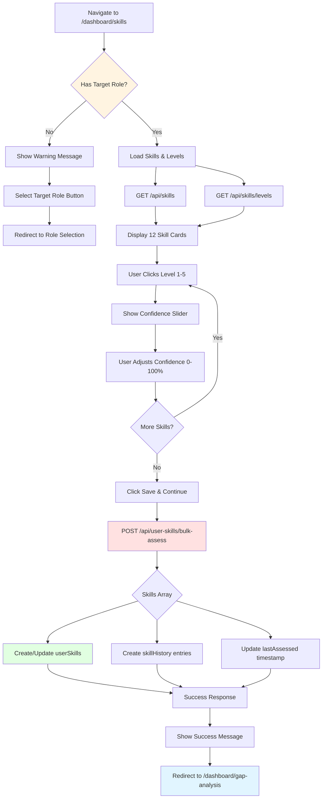

---

### **Phase 3: Analysis & Planning**

#### 3.1 Gap Analysis (`/dashboard/gap-analysis`)
**Frontend**: `GapAnalysisComponent`
**Backend**: `GET /api/analysis/gap/{roleId}`

**User Flow**:
1. **Load Gap Analysis**:
   - Frontend calls `GET /api/analysis/gap/{targetRoleId}`
   - Backend service (`gapCalculation.service.js`):
     - Fetches required skills for target role from `roleSkillMap`
     - Fetches user's current skill levels from `userSkills`
     - Calculates gaps: `gap = requiredLevel - currentLevel`
     - Calculates priority: `priority = gap × weight`
     - Sorts by mandatory first, then priority

2. **User sees**:
   - Target role name
   - Summary statistics:
     - Total skills analyzed
     - Skills mastered (gap ≤ 0)
     - Skills with gaps (gap > 0)
   
   - Skill gap cards:
     - Skill name and category
     - Current level vs Required level
     - Visual gap indicator (colored bar)
     - Gap size (1-5 levels)
     - Priority score
     - "Mandatory" badge (if applicable)
     - Color coding:
       - Red: Large gaps (3+ levels)
       - Yellow: Medium gaps (1-2 levels)
       - Green: Proficient (no gap)

3. **Actions**:
   - Click "View Roadmap" → Navigate to `/dashboard/roadmap`
   - Click "Reassess Skills" → Navigate to `/dashboard/skills`

**Backend Service**: `gapCalculation.service.js`
**Business Logic**:
```javascript
gap = requiredLevel - currentLevel
priority = gap × weight
isMet = currentLevel >= requiredLevel
```

**Database Reads**: `roleSkillMap`, `userSkills`, `skills`, `roles`

---

## 🔍 Gap Analysis Flow

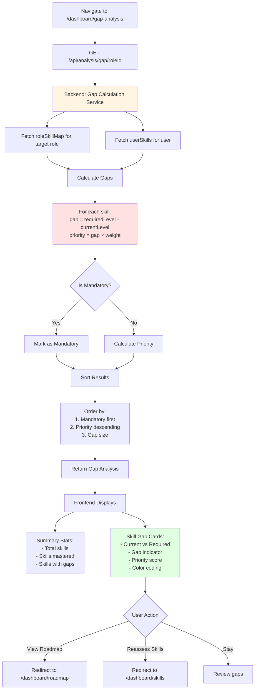

---

#### 3.2 Learning Roadmap (`/dashboard/roadmap`)
**Frontend**: `RoadmapComponent`
**Backend**: `GET /api/analysis/roadmap/{roleId}`, `POST /api/progress/topic/{skillId}/{topicId}`

**User Flow**:
1. **Load Roadmap**:
   - Frontend calls `GET /api/analysis/roadmap/{targetRoleId}`
   - Backend services:
     - `gapCalculation.service.js` → Calculate gaps
     - `dependencyResolver.service.js` → Resolve dependencies
     - `roadmapGeneration.service.js` → Generate ordered roadmap

2. **Roadmap Generation Logic**:
   ```
   1. Identify skills with gaps (requiredLevel > currentLevel)
   2. Resolve dependencies (prerequisite skills)
   3. Order by:
      - Mandatory skills first
      - High priority (largest gaps × weights)
      - Dependencies (prerequisites before dependents)
      - Skill category grouping
   4. Attach learning topics and resources
   ```

3. **User sees**:
   - Summary:
     - Total skills to learn
     - Mandatory skills count
     - Estimated total hours
   
   - Ordered skill cards (expandable):
     - Skill name and level target
     - Mandatory badge
     - Estimated hours
     - Priority score
     - Progress bar (% topics completed)
     - "Dependencies Required" section (if any)
     
     **Expanded view**:
     - Ordered learning topics (1, 2, 3...)
     - Topic name and order
     - Checkboxes to mark complete
     - Topic duration estimates
     - Resource links (official documentation only)
     - Dependency warnings

4. **Progress Tracking**:
   - User clicks checkbox next to topic
   - Frontend calls `POST /api/progress/topic/{skillId}/{topicId}`
   - Backend:
     - Creates/updates `userProgress` document
     - Updates completion status
     - Records timestamp
   - Checkbox turns green with checkmark
   - Progress bar updates

5. **Navigation**:
   - Click "View Gap Analysis" → `/dashboard/gap-analysis`
   - Click "Update Skills" → `/dashboard/skills`

**Backend Services**:
- `roadmapGeneration.service.js` → Main orchestrator
- `dependencyResolver.service.js` → Dependency resolution
- `gapCalculation.service.js` → Gap calculation

**Backend Controller**: `roadmap.controller.js`

**Database**:
- Reads: `roleSkillMap`, `userSkills`, `skillDependencies`, `skillTopics`
- Writes: `userProgress`

---

## 🗺️ Roadmap Generation Flow

```mermaid
flowchart TD
    A[Navigate to /dashboard/roadmap] --> B[GET /api/analysis/roadmap/roleId]
    
    B --> C[Backend: Roadmap Generation Service]
    
    C --> D[Step 1: Gap Calculation]
    D --> E[Identify skills with gaps]
    
    E --> F[Step 2: Dependency Resolution]
    F --> G{Has Dependencies?}
    G -->|Yes| H[Check if dependencies met]
    G -->|No| I[Add to roadmap]
    
    H --> J{Dependencies Met?}
    J -->|No| K[Add dependencies first]
    J -->|Yes| I
    
    K --> L[Mark as blocked]
    L --> I
    
    I --> M[Step 3: Prioritization]
    M --> N[Sort by:<br/>1. Mandatory<br/>2. Priority<br/>3. Dependencies<br/>4. Category]
    
    N --> O[Step 4: Add Topics]
    O --> P[Fetch skillTopics for each skill]
    P --> Q[Order topics by sequence]
    Q --> R[Attach resource links]
    
    R --> S[Step 5: Calculate Estimates]
    S --> T[Sum estimated hours]
    T --> U[Count mandatory skills]
    
    U --> V[Return Complete Roadmap]
    V --> W[Frontend Displays]
    
    W --> X[Summary:<br/>- Total skills<br/>- Mandatory count<br/>- Total hours]
    
    W --> Y[Expandable Skill Cards:<br/>- Topics ordered<br/>- Checkboxes<br/>- Dependencies<br/>- Resources]
    
    Y --> Z{User Clicks Checkbox}
    Z --> AA[POST /api/progress/topic/skillId/topicId]
    AA --> AB[Update userProgress]
    AB --> AC[Show checkmark]
    AC --> AD[Update progress bar]
    
    style C fill:#fff4e1
    style F fill:#ffe1e1
    style M fill:#e1f5ff
    style AA fill:#e1ffe1
```

---

#### 3.3 Readiness Score
**Displayed on**: Dashboard, Profile
**Backend**: `GET /api/analysis/readiness/{roleId}`

**Calculation Logic** (`readinessScore.service.js`):
```javascript
For each required skill:
  if (currentLevel >= requiredLevel) {
    achievedScore += (currentLevel × weight)
  } else {
    achievedScore += (currentLevel × weight)
  }
  totalRequiredScore += (requiredLevel × weight)

readinessPercentage = (achievedScore / totalRequiredScore) × 100

Categories:
- 0-30%: Beginner (red)
- 31-60%: Learning (yellow)
- 61-85%: Proficient (blue)
- 86-100%: Expert (green)
```

**User sees**:
- Circular progress indicator
- Percentage score (0-100%)
- Category label
- Skills breakdown:
  - Ready skills (met requirements)
  - Skills in progress
  - Skills to learn

---

### **Phase 4: Advanced Features**

#### 4.1 Role Comparison (`/dashboard/role-comparison`)
**Frontend**: `RoleComparisonComponent`
**Backend**: `GET /api/roles`, `GET /api/analysis/readiness/{roleId}` (for each role)

**User Flow**:
1. **Load All Roles**:
   - Fetches all 3 roles
   - Calculates readiness for each role in parallel

2. **User sees**:
   - 3 role cards with:
     - Role name
     - "TARGET" badge (if current target)
     - Circular readiness progress
     - Percentage score
     - Skills ready count / Total skills
     - Color-coded by readiness level

3. **Click on role card**:
   - Expands to show detailed breakdown:
     - Overall readiness
     - Ready skills (green check)
     - Skills to improve (red warning)
     - Gap details for each skill

4. **Best Fit Recommendation**:
   - Highlights role with highest readiness
   - Shows which role matches skills best

5. **Actions**:
   - Click "Set as Target" → Updates target role via API
   - Automatically updates dashboard

**Backend**: Multiple `readinessScore.service.js` calls

---

## 📊 Readiness Score Calculation Flow

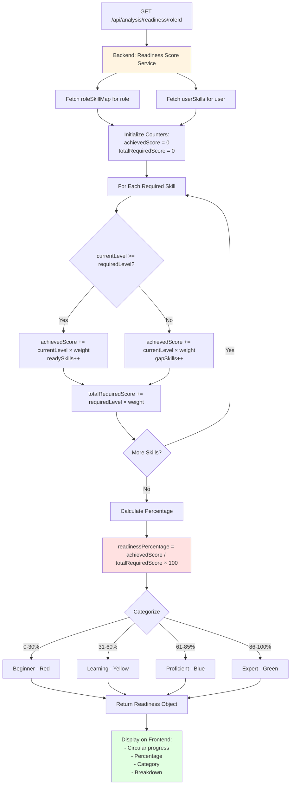

---

## 🔄 Role Comparison Flow

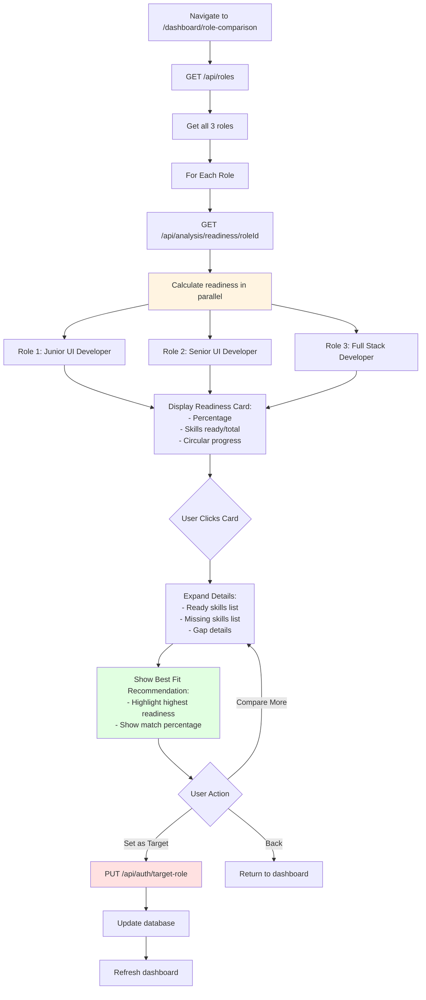

---

#### 4.2 Skill History (`/dashboard/history`)
**Frontend**: `SkillHistoryComponent`
**Backend**: `GET /api/skills/history`

**User Flow**:
1. **Load History**:
   - Backend queries `skillHistory` collection
   - Returns chronological list of all skill assessments

2. **User sees**:
   - Timeline of skill updates:
     - Skill name
     - Old level → New level
     - Change indicator (↑ improved, ↓ reassessed lower)
     - Timestamp
     - Confidence score
   
   - Filters/sorting:
     - By skill
     - By date
     - By improvement type

3. **Visual Progress**:
   - Chart showing skill growth over time
   - Skill-by-skill progress lines

**Database**: Reads from `skillHistory`

---

#### 4.3 User Profile (`/dashboard/profile`)
**Frontend**: `ProfileComponent`
**Backend**: `PUT /api/auth/profile`

**User Flow**:
1. **View Profile**:
   - Name
   - Email (read-only)
   - Experience years
   - Current role
   - Account statistics:
     - Member since
     - Skills assessed
     - Target role
     - Readiness score

2. **Edit Profile**:
   - Update name
   - Update experience years
   - Update current role

3. **Save**:
   - Frontend calls `PUT /api/auth/profile`
   - Backend updates user document
   - Updates localStorage and signal

**Backend Controller**: `auth.controller.js::updateProfile`
**Database**: Updates `users` collection

---

### **Phase 5: Continuous Usage**

#### 5.1 Dashboard Loop
Users typically follow this cycle:

```
1. Dashboard → View readiness
2. Roadmap → Check topics to learn
3. Study/practice → External resources
4. Skills → Reassess proficiency
5. Gap Analysis → See improvements
6. Roadmap → Updated priorities
7. Track progress → Mark topics complete
8. Repeat
```

#### 5.2 Progress Tracking
- Checkbox system on roadmap
- `userProgress` collection tracks completion
- Real-time progress bars update
- History shows all changes

#### 5.3 Skill Reassessment
- User can reassess skills anytime
- New assessment creates `skillHistory` entry
- Gap analysis updates automatically
- Roadmap recalculates priorities

---

## 🔐 Security & Authentication

## 🔐 JWT Authentication Flow

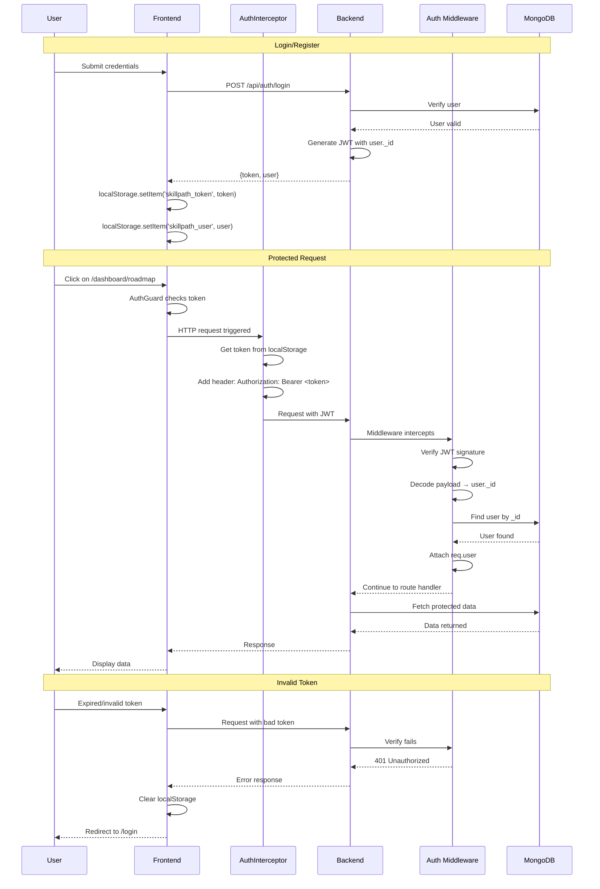

---

### JWT Flow Details
1. Login/Register → Backend generates JWT
2. Token stored in localStorage (`skillpath_token`)
3. `AuthInterceptor` adds token to all HTTP requests:
   ```
   Authorization: Bearer <token>
   ```
4. Backend `auth.middleware.js` validates token
5. Protected routes require valid token

### Protected Routes (Frontend)
- All `/dashboard/*` routes use `authGuard`
- Checks for token and valid user in localStorage
- Redirects to `/login` if unauthenticated

### Protected Routes (Backend)
- All routes except `/auth/register`, `/auth/login`, `/roles`, `/skills` require `protect` middleware
- Middleware verifies JWT
- Attaches `req.user` to request
- Returns 401 if invalid

---

## 📊 Database Schema Summary

### Collections (11 total)

1. **users** - User accounts
2. **roles** - Job roles (Junior/Senior UI, Full Stack)
3. **skills** - 12 core technical skills
4. **skillLevels** - 5 proficiency levels (Beginner-Expert)
5. **roleSkillMap** - Required skills per role (with weights, mandatory flags)
6. **skillDependencies** - Prerequisite relationships
7. **skillTopics** - Learning topics per skill (ordered, with resources)
8. **userSkills** - User's current skill assessments
9. **userProgress** - Topic completion tracking
10. **skillHistory** - Skill assessment timeline
11. **roleComparison** - Role readiness comparisons

---

## 🎨 UI/UX Features

### Theme Support
- Light/Dark mode toggle
- Persisted in localStorage
- `ThemeService` manages state
- Tailwind `dark:` classes

### Responsive Design
- Mobile-first approach
- Hamburger menu on mobile
- Touch-friendly buttons
- Responsive grids

### Accessibility
- WCAG 2.1 AA compliance
- Semantic HTML
- ARIA labels
- Keyboard navigation
- Focus indicators

### Visual Feedback
- Loading spinners
- Success/error messages
- Color-coded progress (red/yellow/green)
- Animated transitions
- Hover states

---

## 🚀 API Endpoints Summary

### Authentication
- `POST /api/auth/register` - Create account
- `POST /api/auth/login` - Sign in
- `GET /api/auth/me` - Get current user
- `PUT /api/auth/profile` - Update profile
- `PUT /api/auth/target-role` - Set target role

### Roles & Skills
- `GET /api/roles` - List all roles
- `GET /api/roles/{id}` - Get role details
- `GET /api/roles/{id}/skills` - Get required skills for role
- `GET /api/skills` - List all skills
- `GET /api/skills/levels` - Get skill level definitions

### User Skills
- `GET /api/user-skills` - Get user's skill assessments
- `POST /api/user-skills/assess` - Assess single skill
- `POST /api/user-skills/bulk-assess` - Assess multiple skills

### Analysis
- `GET /api/analysis/gap/{roleId}` - Calculate skill gaps
- `GET /api/analysis/roadmap/{roleId}` - Generate learning roadmap
- `GET /api/analysis/readiness/{roleId}` - Calculate readiness score

### Progress
- `POST /api/progress/topic/{skillId}/{topicId}` - Mark topic complete
- `GET /api/skills/history` - Get skill assessment history

### Dashboard
- `GET /api/dashboard` - Get dashboard summary stats

---

## 💡 Key Business Logic

### Gap Calculation
```
gap = requiredLevel - currentLevel
priority = gap × weight
isMandatory = roleSkillMap.mandatory
```

### Roadmap Ordering
```
1. Mandatory skills first
2. Sort by priority (gap × weight) descending
3. Respect dependencies (prerequisites first)
4. Group by skill category
5. Order topics within each skill
```

### Readiness Score
```
achievedScore = Σ(min(currentLevel, requiredLevel) × weight)
totalRequiredScore = Σ(requiredLevel × weight)
readinessPercentage = (achievedScore / totalRequiredScore) × 100
```

### Dependency Resolution
```
if skill has dependencies:
  ensure dependencies have no gaps
  if dependency has gap:
    add dependency to roadmap first
    mark current skill as "blocked"
```

---

## 🎯 Success Metrics

### User Onboarding
- Account creation → 1 step
- Role selection → 1 step
- Skill assessment → 1 step
- First roadmap → Automatic

### Engagement
- Users can see progress immediately
- Clear actionable steps
- Real-time feedback
- Motivational UI

### Data Quality
- Real-world job description data
- Industry-standard frameworks
- Official documentation links only
- Curated by research

---

## 📝 Notes

### Frontend Data Flow

```mermaid
flowchart LR
    A[User Action] --> B[Component]
    B --> C[ApiService]
    C --> D[HttpClient]
    D --> E[AuthInterceptor<br/>Add JWT]
    E --> F[Backend API]
    
    F --> G[Response]
    G --> H[ApiService<br/>Map Data]
    H --> I[Component]
    I --> J[Update Signal]
    J --> K[Angular Change Detection]
    K --> L[UI Renders]
    
    style A fill:#e1f5ff
    style E fill:#fff4e1
    style F fill:#ffe1e1
    style J fill:#e1ffe1
    style L fill:#f0e1ff
```

**Detailed Flow:**
```
Component → ApiService → HttpClient → Interceptor (adds JWT) → Backend
Backend Response → ApiService (maps data) → Component → Signals update → UI renders
```

### State Management
- Angular Signals for reactive state
- localStorage for persistence
- No external state library needed
- Automatic UI updates on signal changes

### Error Handling
- Backend: Centralized `errorHandler` middleware
- Frontend: Try-catch in components, error signals
- User-friendly error messages
- Console logging for debugging

---

## 🔄 Typical User Session Flow

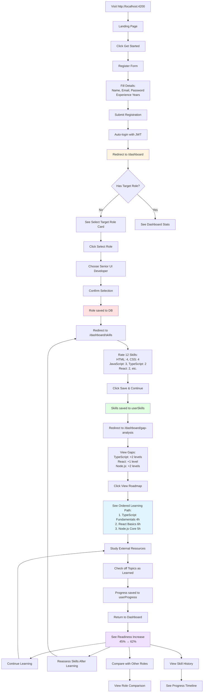

**Step-by-Step Journey:**
```
1. Visit http://localhost:4200
2. Click "Get Started" → Register
3. Fill form → Auto-login → Redirect to dashboard
4. See "Select Target Role" card → Click
5. Choose "Senior UI Developer" → Confirm
6. Redirect to skills assessment
7. Rate 12 skills (HTML: 4, CSS: 4, JS: 3, etc.)
8. Click "Save & Continue" → Redirect to gap analysis
9. See gaps: TypeScript (need +2), React (+1), etc.
10. Click "View Roadmap"
11. See ordered learning path:
    - TypeScript Fundamentals (4h)
    - React Basics (6h)
    - Advanced CSS (3h)
12. Check off topics as learned
13. Return to dashboard → See readiness increase
14. Reassess skills after learning
15. Repeat cycle
```

---

## 📊 Database Schema Relationships

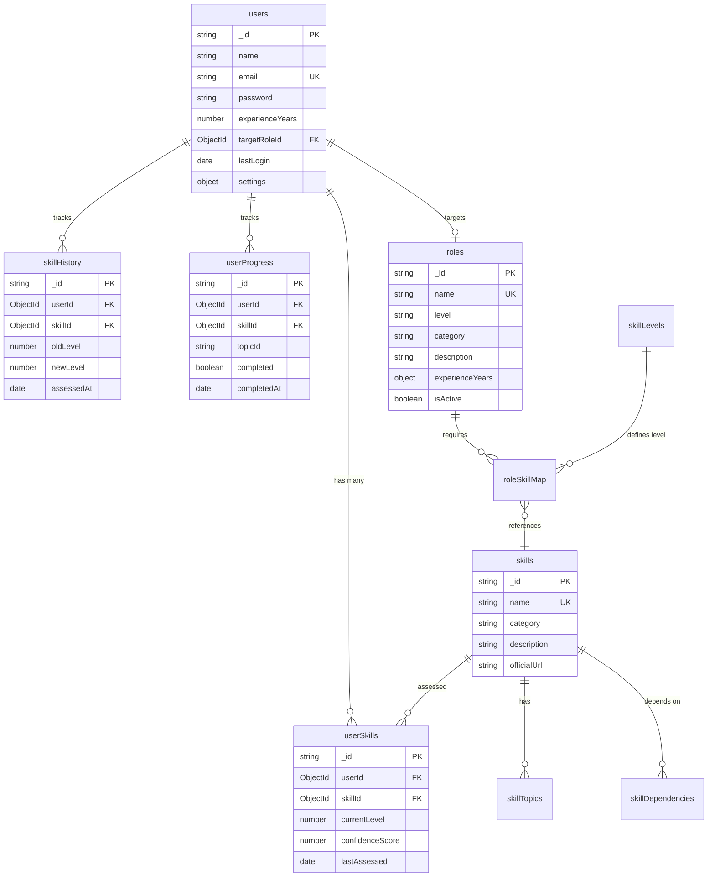

---

## 🎊 Conclusion

SkillPath provides a complete, data-driven career development platform with:
- ✅ Personalized skill gap analysis
- ✅ Intelligent learning roadmaps
- ✅ Progress tracking
- ✅ Role comparisons
- ✅ Real-world data
- ✅ Beautiful, accessible UI
- ✅ Secure authentication
- ✅ Comprehensive API

**Tech Stack**: Angular 19 + Node.js + Express + MongoDB + Tailwind CSS
**Status**: Fully functional MVP with 3 roles, 12 skills, complete user flow

---

## 📈 Visual Summary

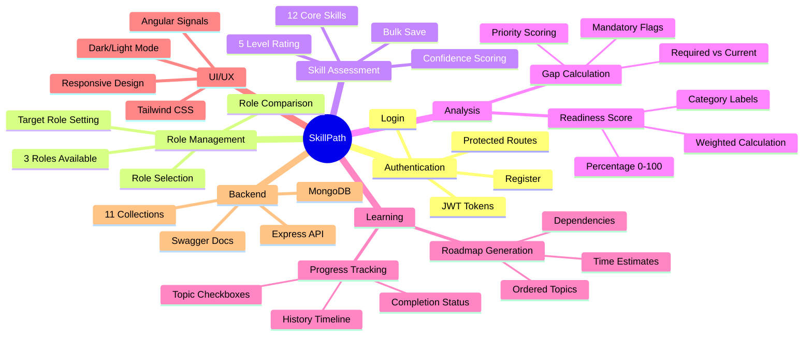

